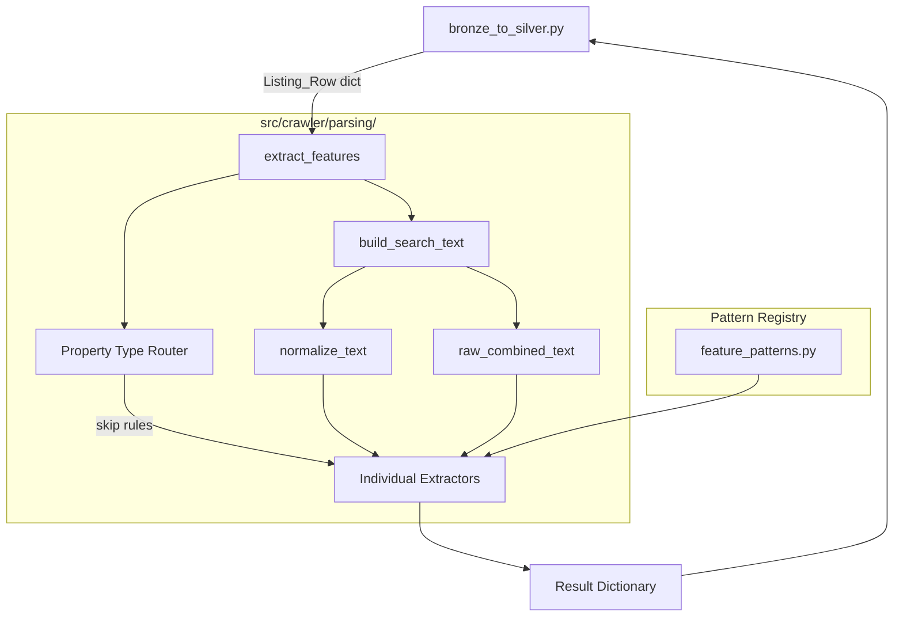
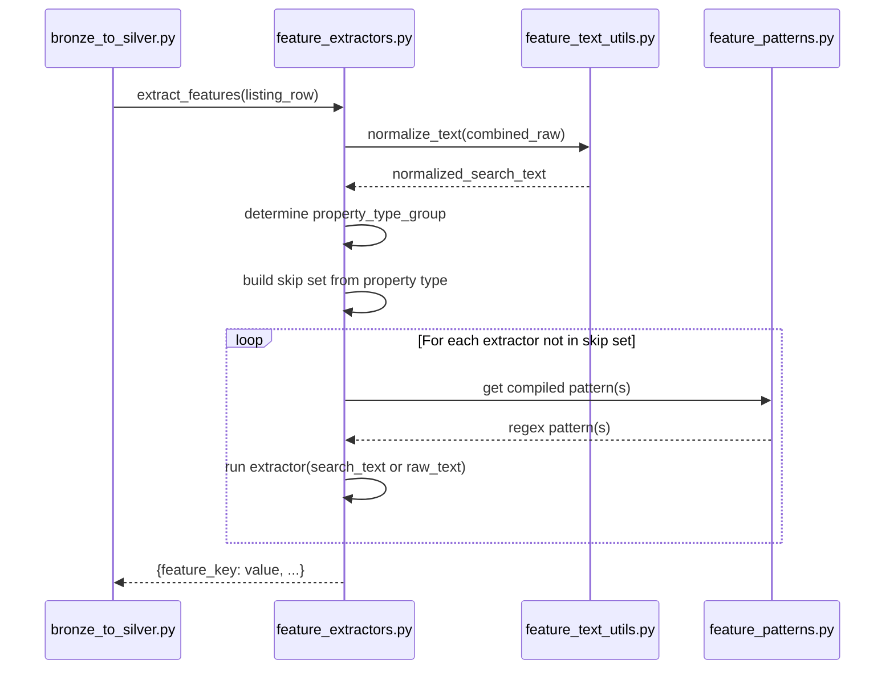

# Design Document: Feature Extraction Regex

## Overview

This module implements a regex/rule-based feature extraction pipeline that parses raw Vietnamese text from batdongsan.com.vn property listings to extract 16 structured attribute groups into 22 stable Silver columns. It sits between the existing `parse_listing()` output and the quality-check step in the Bronze-to-Silver transformation pipeline.

The module is designed around three principles:
1. **Separation of concerns** — pattern definitions live apart from extraction logic and text utilities
2. **Property-type awareness** — extractors are selectively skipped based on property type (apartment, land, etc.)
3. **Fault isolation** — individual extractor failures are caught and logged without aborting the pipeline

### Integration Point

```
Bronze metadata/text → parse_listing() → [Silver record] → extract_features() → [enriched record] → apply_quality_flags()
```

The `extract_features()` function accepts the Silver record dictionary produced by `parse_listing()` and returns a dictionary of extracted feature keys. The caller (`src/transform/bronze_to_silver.py`) merges these into the record before passing to quality checks. `apply_quality_flags()` must preserve regex-detected negotiable-price signals by setting `is_price_negotiable = (price_unit == "negotiable" or bool(existing is_price_negotiable))`.

## Architecture

### High-Level Architecture



### Module Layout

```
src/crawler/parsing/
├── __init__.py              # Public API: extract_features, normalize_text, FEATURE_PATTERNS, FEATURE_OUTPUT_KEYS
├── feature_text_utils.py    # Text normalization utilities
├── feature_patterns.py      # Pre-compiled regex patterns dictionary
└── feature_extractors.py    # Individual extract_* functions + orchestrator
```

### Data Flow



## Components and Interfaces

### feature_text_utils.py

```python
def normalize_text(text: str | None) -> str:
    """
    Normalize Vietnamese text for pattern matching.
    
    Operations (in order):
    1. Return "" for None/empty input
    2. Lowercase
    3. NFD decomposition + remove combining marks (category Mn)
    4. đ/Đ → d
    5. Symbol normalization (m² → m2, m³ → m3)
    6. Collapse whitespace, replace newlines with space, trim
    
    Returns: ASCII-equivalent normalized string
    """

def build_search_text(listing_row: dict) -> tuple[str, str]:
    """
    Build combined search text from listing fields.
    
    Concatenates: title_raw, description_raw, location_raw, property_type_raw, project_raw
    Skips null/NaN/empty/whitespace-only fields.
    
    Returns: (normalized_search_text, raw_combined_text)
    """
```

### feature_patterns.py

```python
from typing import Dict, List
import re

# Type alias for pattern entries
PatternEntry = re.Pattern | List[re.Pattern]

FEATURE_PATTERNS: Dict[str, Dict[str, PatternEntry]] = {
    "legal_status": {
        "keywords": re.compile(r"..."),
        "red_pink_book": re.compile(r"..."),
    },
    "floor_count": {
        "standard": re.compile(r"..."),
        "tret_lau": re.compile(r"..."),
    },
    "seller_type": {
        "owner_negation": [re.compile(r"..."), ...],
        "owner": [re.compile(r"..."), ...],
        "broker": [re.compile(r"..."), ...],
    },
    # ... patterns for all 16 features
}
```

All patterns are pre-compiled at module load time. Extraction functions import from this module and never define inline regex.

### feature_extractors.py

```python
from typing import Any, Dict, Optional

FEATURE_OUTPUT_KEYS = [
    "has_legal_info",
    "legal_status_raw",
    "has_red_pink_book",
    "floor_count",
    "seller_type",
    "furniture_level",
    "frontage_width",
    "bathroom_count",
    "project_name",
    "bedroom_count",
    "is_business_suitable",
    "has_urban_area_flag",
    "has_security_flag",
    "has_educated_community_flag",
    "has_high_intellect_flag",
    "has_residential_area_flag",
    "has_subdivision_flag",
    "direction",
    "is_price_negotiable",
    "has_car_access",
    "car_access_type",
    "building_name",
]

# --- Individual Extractors ---

def extract_legal_status(search_text: str) -> Dict[str, Any]:
    """Returns: {has_legal_info, legal_status_raw, has_red_pink_book}"""

def extract_floor_count(search_text: str) -> Optional[int]:
    """Returns: floor count integer or None. Validates range [1, 50]."""

def extract_seller_type(search_text: str) -> Optional[str]:
    """Returns: 'owner', 'broker', or None."""

def extract_furniture_level(search_text: str) -> Optional[str]:
    """Returns: 'full', 'basic', 'raw', 'mentioned', or None."""

def extract_frontage_width(search_text: str) -> Optional[float]:
    """Returns: width in meters or None. Validates range [1.0, 100.0]."""

def extract_bathroom_count(search_text: str) -> Optional[int]:
    """Returns: bathroom count or None. Validates range [1, 20]."""

def extract_project_name(raw_text: str) -> Optional[str]:
    """Operates on raw accented text. Returns: project name or None."""

def extract_bedroom_count(search_text: str) -> Optional[int]:
    """Returns: bedroom count or None. Validates range [1, 30]."""

def extract_business_suitability(search_text: str) -> bool:
    """Returns: True if business keywords found, else False."""

def extract_location_context(search_text: str) -> Dict[str, bool]:
    """Returns: {has_urban_area_flag, has_residential_area_flag, has_security_flag,
                 has_educated_community_flag, has_high_intellect_flag, has_subdivision_flag}"""

def extract_direction(search_text: str) -> Optional[str]:
    """Returns: normalized direction string or None."""

def extract_negotiable_price(search_text: str) -> bool:
    """Returns: True if negotiable keywords found (without negation), else False."""

def extract_car_access(search_text: str) -> Dict[str, Any]:
    """Returns: {has_car_access, car_access_type}"""

def extract_building_name(raw_text: str) -> Optional[str]:
    """Operates on raw accented text. Returns: building name or None."""

# --- Orchestrator ---

PROPERTY_TYPE_SKIP_MAP: Dict[str, set] = {
    "apartment": {"floor_count", "frontage_width", "car_access"},
    "land": {"floor_count", "bedroom_count"},
}

def extract_features(listing_row: dict) -> Dict[str, Any]:
    """
    Main entry point. Accepts a Listing_Row dictionary.
    
    1. Builds search text (normalized + raw)
    2. Determines property_type_group
    3. Applies skip rules
    4. Runs each extractor, catching exceptions per-extractor
    5. Returns dict with all feature keys (null for skipped/failed)
    """
```

### __init__.py

```python
from crawler.parsing.feature_text_utils import normalize_text, build_search_text
from crawler.parsing.feature_patterns import FEATURE_PATTERNS
from crawler.parsing.feature_extractors import FEATURE_OUTPUT_KEYS, extract_features

__all__ = ["extract_features", "normalize_text", "FEATURE_PATTERNS", "FEATURE_OUTPUT_KEYS"]
```

## Data Models

### Input: Listing_Row Dictionary

The input is the Silver record dictionary produced by `parse_listing()`. Relevant fields consumed:

| Field | Type | Description |
|-------|------|-------------|
| `title_raw` | `str \| None` | Listing title |
| `description_raw` | `str \| None` | Listing description (up to 3000 chars) |
| `location_raw` | `str \| None` | Location text |
| `property_type_raw` | `str \| None` | Raw property type / crawl category |
| `project_raw` | `str \| None` | Project name from location parser |
| `property_type_group` | `str \| None` | Normalized type: apartment, house, villa_townhouse, land, street_house, unknown |
| `bedroom_count` | `int \| None` | Existing bedroom count from parser |
| `bathroom_count` | `int \| None` | Existing bathroom count from parser |

### Output: Extracted Features Dictionary

```python
{
    # Legal (Req 3)
    "has_legal_info": bool,           # True if any legal keyword found
    "legal_status_raw": str | None,   # First matched keyword phrase (max 100 chars)
    "has_red_pink_book": bool,        # True if sổ đỏ/hồng/riêng found

    # Structure (Req 4, 7)
    "floor_count": int | None,        # Number of floors [1-50], null for apartments
    "frontage_width": float | None,   # Meters [1.0-100.0], null for apartments

    # Seller (Req 5)
    "seller_type": str | None,        # "owner", "broker", or None

    # Furniture (Req 6)
    "furniture_level": str | None,    # "full", "basic", "raw", "mentioned", or None

    # Rooms (Req 8, 10)
    "bathroom_count": int | None,     # [1-20], prefers existing value
    "bedroom_count": int | None,      # [1-30], prefers existing value

    # Project (Req 9)
    "project_name": str | None,       # Extracted from raw accented text (max 100 chars)

    # Business (Req 11)
    "is_business_suitable": bool,     # True if business keywords found

    # Location context (Req 12)
    "has_urban_area_flag": bool,
    "has_security_flag": bool,
    "has_educated_community_flag": bool, # Compatibility alias for educated-community wording
    "has_high_intellect_flag": bool,
    "has_residential_area_flag": bool,
    "has_subdivision_flag": bool,

    # Direction (Req 13)
    "direction": str | None,          # One of 8 standard directions or None

    # Price (Req 14)
    "is_price_negotiable": bool,      # True if negotiable keywords found; OR-combined with price_unit quality logic

    # Car access (Req 15)
    "has_car_access": bool,           # True if car access keywords found
    "car_access_type": str | None,    # "car_can_enter", "car_can_park", "car_can_pass", or None

    # Building (Req 16)
    "building_name": str | None,      # Extracted from raw accented text (max 50 chars)
}
```

### Property Type Group Mapping

| property_type_group | Skipped Extractors |
|--------------------|--------------------|
| `"apartment"` | floor_count, frontage_width, car_access |
| `"land"` | floor_count, bedroom_count |
| `"house"` | (none) |
| `"villa_townhouse"` | (none) |
| `"street_house"` | (none) |
| `"unknown"` / `None` | (none — run all) |

### Validation Ranges

| Feature | Min | Max | Type |
|---------|-----|-----|------|
| floor_count | 1 | 50 | int |
| frontage_width | 1.0 | 100.0 | float |
| bathroom_count | 1 | 20 | int |
| bedroom_count | 1 | 30 | int |

Values outside these ranges are discarded (set to null).

## Correctness Properties

*A property is a characteristic or behavior that should hold true across all valid executions of a system — essentially, a formal statement about what the system should do. Properties serve as the bridge between human-readable specifications and machine-verifiable correctness guarantees.*

### Property 1: Text normalization produces valid ASCII output

*For any* Vietnamese text string (including strings with diacritical marks, đ/Đ characters, mixed case, multiple whitespace, and newlines), `normalize_text` SHALL produce output that: (a) contains no Unicode combining marks (category Mn), (b) contains no đ or Đ characters, (c) is entirely lowercase, (d) contains no consecutive whitespace characters, (e) has no leading or trailing whitespace, and (f) contains no newline characters.

**Validates: Requirements 1.1, 1.2, 1.3, 1.4, 1.5**

### Property 2: Search text construction preserves content and normalization relationship

*For any* Listing_Row dictionary with arbitrary combinations of null/non-null text fields, `build_search_text` SHALL return a tuple `(normalized, raw)` where: (a) `normalized == normalize_text(raw)`, (b) every non-null, non-empty, non-whitespace-only field value appears as a substring within `raw`, and (c) `raw` contains no double-space separators.

**Validates: Requirements 2.1, 2.2, 2.4, 2.5, 1.8**

### Property 3: Legal keyword detection consistency

*For any* normalized text string that contains at least one legal status keyword from the defined set, `extract_legal_status` SHALL return `has_legal_info=True` and `legal_status_raw` as a non-null string with length ≤ 100. Conversely, *for any* text that contains none of the legal keywords, it SHALL return `has_legal_info=False`, `legal_status_raw=None`, and `has_red_pink_book=False`.

**Validates: Requirements 3.1, 3.2, 3.5**

### Property 4: Red/pink book detection is a subset of legal detection

*For any* text where `has_red_pink_book` is True, `has_legal_info` SHALL also be True. Specifically, *for any* text containing "so do", "so hong", or "so rieng", both `has_red_pink_book` and `has_legal_info` SHALL be True.

**Validates: Requirements 3.4**

### Property 5: Numeric extraction respects validation ranges

*For any* text containing a floor count pattern with numeric value N, `extract_floor_count` SHALL return N if 1 ≤ N ≤ 50, and null otherwise. *For any* text containing a frontage pattern with value X, `extract_frontage_width` SHALL return X if 1.0 ≤ X ≤ 100.0, and null otherwise. *For any* text containing a bathroom pattern with value N, `extract_bathroom_count` SHALL return N if 1 ≤ N ≤ 20, and null otherwise. *For any* text containing a bedroom pattern with value N, `extract_bedroom_count` SHALL return N if 1 ≤ N ≤ 30, and null otherwise.

**Validates: Requirements 4.4, 4.5, 7.3, 7.4, 8.2, 8.3, 10.2, 10.3**

### Property 6: Seller type priority and negation handling

*For any* text, `extract_seller_type` SHALL follow the priority chain: (1) if text contains a negation-prefixed broker keyword (e.g., "khong tiep moi gioi"), classify as "owner"; (2) if text contains any owner keyword, return "owner"; (3) if text contains any broker keyword (not negation-prefixed), return "broker"; (4) otherwise return null. Owner always takes priority over broker.

**Validates: Requirements 5.1, 5.2, 5.3, 5.4, 5.5**

### Property 7: Furniture level priority ordering

*For any* text, `extract_furniture_level` SHALL return the highest-priority match according to: full > basic > raw > mentioned > null. If text contains keywords from multiple levels, the higher-priority level SHALL always be returned regardless of keyword position in text.

**Validates: Requirements 6.1, 6.2, 6.3, 6.5, 6.7**

### Property 8: Frontage extraction does not match area values

*For any* text containing a numeric value followed by "m2", "m²", or "m³", `extract_frontage_width` SHALL NOT extract that value as a frontage width. Only "m" not followed by "2" or "²" qualifies as a frontage unit.

**Validates: Requirements 7.5**

### Property 9: Property-type-aware skip rules

*For any* listing with `property_type_group = "apartment"`, the output SHALL have `floor_count=null`, `frontage_width=null`, `has_car_access=null`, and `car_access_type=null` regardless of text content. *For any* listing with `property_type_group = "land"`, the output SHALL have `floor_count=null` and `bedroom_count=null` regardless of text content.

**Validates: Requirements 4.3, 7.2, 15.3, 17.1, 17.2**

### Property 10: Existing value preservation

*For any* Listing_Row where `bedroom_count` is already non-null, the output `bedroom_count` SHALL equal the existing value. *For any* Listing_Row where `bathroom_count` is already non-null, the output `bathroom_count` SHALL equal the existing value. *For any* Listing_Row where `project_raw` is already non-null, the output `project_name` SHALL equal the existing `project_raw` value.

**Validates: Requirements 8.5, 9.4, 10.4**

### Property 11: Output dictionary structure invariant

*For any* input (including null, empty dict, or valid Listing_Row), `extract_features` SHALL return a dictionary containing exactly the 22 expected feature keys listed in `FEATURE_OUTPUT_KEYS`. No keys shall be missing and no extra keys shall be present.

**Validates: Requirements 17.3, 18.1, 18.5**

### Property 12: Business keyword word-boundary matching

*For any* text where a short business keyword ("kd", "shop", "spa", "cafe") appears only as a substring within a longer word (not at a word boundary), `extract_business_suitability` SHALL return False. Conversely, *for any* text where the keyword appears at a word boundary, it SHALL return True.

**Validates: Requirements 11.3**

### Property 13: Direction extraction requires "huong" prefix

*For any* text containing a direction word (dong, tay, nam, bac, etc.) without a preceding "huong" prefix pattern, `extract_direction` SHALL return null. *For any* text containing "huong" followed by a valid direction word, it SHALL return the normalized direction value (one of 8 standard values).

**Validates: Requirements 13.1, 13.4, 13.3**

### Property 14: Negotiable price negation handling

*For any* text where a negotiable keyword is immediately preceded (within 3 words) by a negation modifier ("khong", "chua", "khong co"), `extract_negotiable_price` SHALL return False. *For any* text containing a negotiable keyword without a preceding negation, it SHALL return True.

**Validates: Requirements 14.1, 14.2, 14.3**

### Property 15: Car access type categorization consistency

*For any* text containing a car access keyword, `extract_car_access` SHALL return `has_car_access=True` and `car_access_type` matching the sub-category that the keyword belongs to ("car_can_enter", "car_can_park", or "car_can_pass"). The keyword-to-category mapping SHALL be deterministic and consistent.

**Validates: Requirements 15.1, 15.2**

### Property 16: Fault isolation — extractor exceptions do not crash pipeline

*For any* Listing_Row input, if a single extractor raises an exception during processing, `extract_features` SHALL still return a complete dictionary with the failing feature set to null and all other features extracted normally.

**Validates: Requirements 18.3**

### Property 17: "Tret B lau" floor count calculation

*For any* text containing the compound format "A tret B lau" where B is a valid integer, `extract_floor_count` SHALL return 1 + B as the total floor count.

**Validates: Requirements 4.2**

## Error Handling

### Per-Extractor Exception Isolation

Each individual extractor is called within a try/except block in the orchestrator. If an extractor raises any exception:

1. The exception is caught
2. A warning is logged with the feature name and exception message (using `src/common/logger.py`)
3. The feature value is set to `null`
4. Processing continues with the next extractor

```python
for feature_name, extractor_fn in extractors.items():
    if feature_name in skip_set:
        result[feature_name] = None
        continue
    try:
        result[feature_name] = extractor_fn(search_text_or_raw)
    except Exception as e:
        logger.warning(f"Extractor '{feature_name}' failed: {e}")
        result[feature_name] = None
```

### Input Validation

- `None` or empty input to `normalize_text` → returns `""`
- `None` or missing-field Listing_Row to `extract_features` → returns all-null dictionary
- NaN values in fields (from pandas) → treated as null/empty during search text construction

### Range Validation Failures

When an extracted numeric value falls outside its valid range, the value is silently discarded (set to null). No exception is raised and no warning is logged — this is expected behavior for noisy real-world text.

### Pattern Match Failures

If no pattern matches for a given extractor, the extractor returns its default value (null for optional fields, False for boolean flags). This is normal operation, not an error condition.

## Testing Strategy

### Property-Based Testing

This feature is highly suitable for property-based testing because:
- All extractors are pure functions with clear input/output behavior
- The input space is large (arbitrary Vietnamese text strings)
- Universal properties hold across all valid inputs
- Execution is fast (in-memory regex matching, no I/O)

**Library**: [Hypothesis](https://hypothesis.readthedocs.io/) (Python PBT framework)

**Configuration**:
- Minimum 100 examples per property test (`@settings(max_examples=100)`)
- Each test tagged with: `# Feature: feature-extraction-regex, Property {N}: {title}`

**Generators needed**:
- Vietnamese text generator (random Unicode strings with Vietnamese diacritical marks, đ/Đ, whitespace variations)
- Listing_Row generator (random combinations of null/non-null fields)
- Keyword-injected text generator (random text with a specific keyword inserted at a random position)
- Numeric pattern generator (random numbers formatted into regex pattern templates)

### Unit Tests (Example-Based)

Unit tests cover:
- Specific Vietnamese text normalization cases (m² → m2, Đ → d, order-dependent cases)
- Each keyword variant for each extractor (smoke-test all keywords)
- Edge cases: null input, empty string, all-whitespace, NaN fields
- Symbol normalization (m², m³)
- The "tret lau" compound format with specific examples
- Building name extraction preserving accents

### Integration Tests

- End-to-end test: feed a real Bronze listing through `parse_listing()` → `extract_features()` → verify enriched output
- Performance benchmark: process 100+ listings, verify average < 50ms per listing
- Integration with `bronze_to_silver.py`: verify the pipeline produces valid Silver records with feature columns

### Test File Structure

```
tests/
├── test_text_utils.py           # Unit + property tests for normalization
├── test_feature_extractors.py   # Property tests for each extractor
├── test_feature_patterns.py     # Smoke tests verifying patterns compile and match expected keywords
├── test_orchestrator.py         # Property tests for extract_features orchestrator
└── test_integration.py          # End-to-end pipeline integration tests
```

