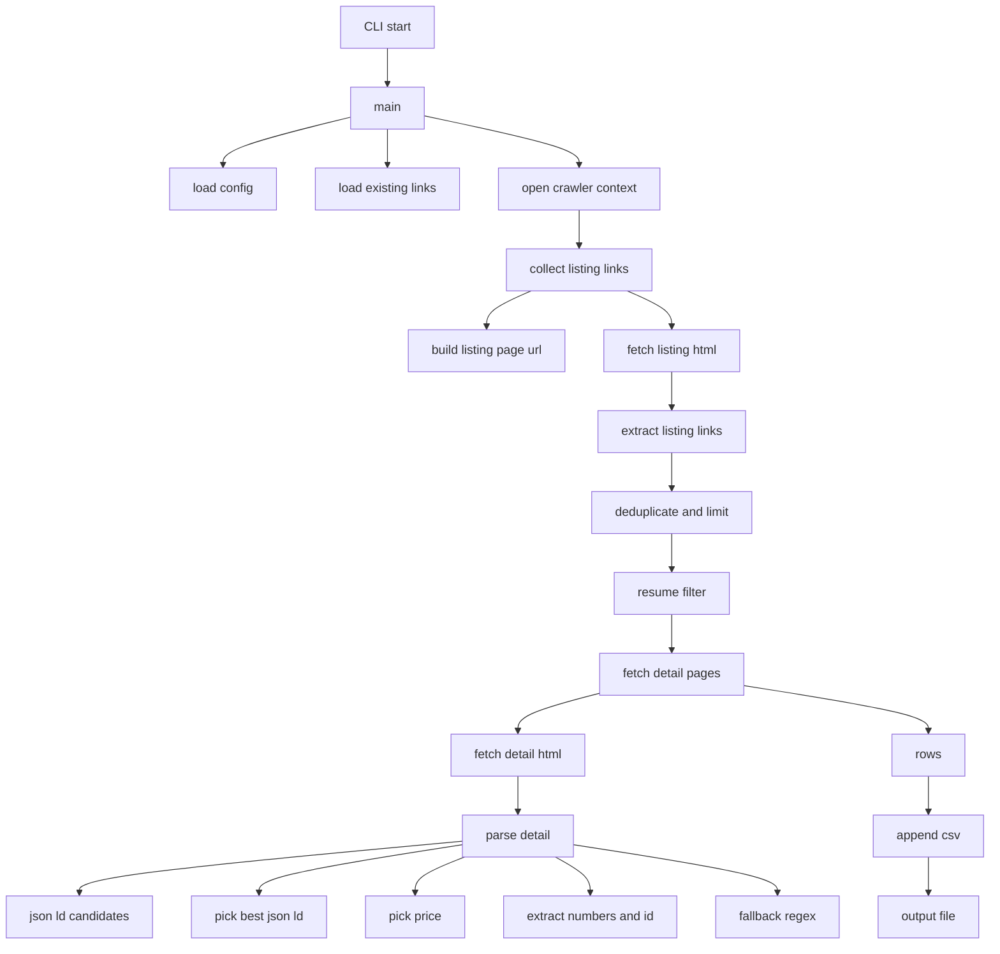
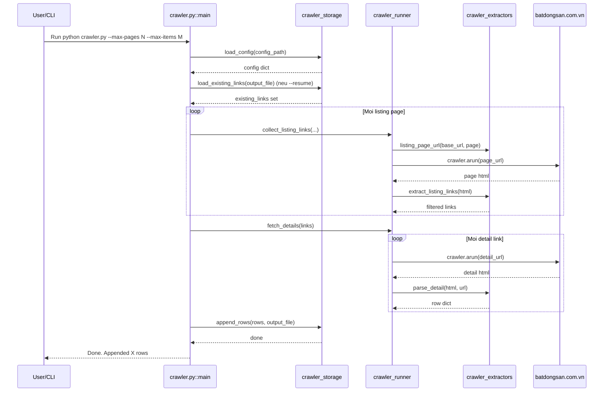

# Crawler Architecture

Tai lieu nay mo ta luong chay cua crawler bang Mermaid de ban de hinh dung.

## 1) Tong quan luong ham

### Giai thich nhanh

- crawler.py: entrypoint, doc tham so, goi pipeline.
- crawler_storage.py: doc config, doc link da co (resume), ghi CSV.
- crawler_runner.py: dieu phoi crawl listing pages va detail pages.
- crawler_extractors.py: toan bo logic trich xuat field tu HTML/JSON-LD.
- crawler_settings.py: constants dung chung.

## 2) Trinh tu thuc thi theo thoi gian

### Giai thich nhanh

- Vong 1: lay danh sach URL chi tiet tu cac trang listing.
- Vong 2: vao tung URL chi tiet de parse truong du lieu.
- Cuoi cung: ghi tat ca row vao CSV theo schema OUTPUT_COLUMNS.

## 3) Mapping truong du lieu (tam tat)

- title, description: uu tien JSON-LD, fallback title tag.
- price, price_raw: uu tien offers.price trong JSON-LD, fallback regex text.
- property_size, property_size_raw: uu tien floorSize JSON-LD, fallback regex m2.
- bedrooms, bathrooms: regex tren text da loai bo HTML tags.
- city, district: suy doan tu URL slug khi khong co du lieu ro rang.

## 4) Cach su dung file nay

1. Mo file nay trong VS Code.
2. Neu can preview: Open Preview to the Side.
3. Chinh sua Mermaid block neu ban doi ten ham/module.
