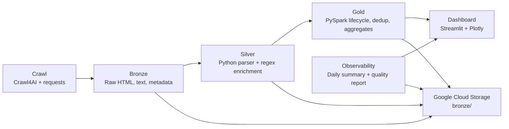

# Real Estate Lakehouse Pipeline Architecture

## Layers

| Layer | Technology | Purpose |
|---|---|---|
| Crawl | Crawl4AI, requests, BeautifulSoup | Download listing pages and extract raw page artifacts |
| Bronze | Local filesystem, Hive-style partitions | Store raw HTML, raw text, metadata, and crawl logs |
| Silver | Python parser, normalizers, regex enrichment, pandas/pyarrow | Normalize listing fields and add feature extraction columns |
| Gold | PySpark | Deduplicate snapshots, track listing lifecycle, compute market aggregates |
| Dashboard | Streamlit, Plotly, pandas | Explore Gold tables and pipeline health |
| Cloud Storage | Google Cloud Storage | Sync Bronze, Silver, Gold, and logs for backup/demo |

## Data Flow

1. Crawl jobs create `data/bronze/source=batdongsan/crawl_date=YYYY-MM-DD/crawl_id=...`.
2. Bronze-to-Silver parses metadata/raw text into normalized listing records.
3. Silver-to-Gold reads all Silver parquet files and builds lifecycle tables.
4. Validation checks Gold outputs and writes summary artifacts.
5. Observability writes daily run summaries and quality reports.
6. Dashboard reads Gold tables and observability summaries.
7. GCS sync uploads data layers and logs to the configured bucket.
