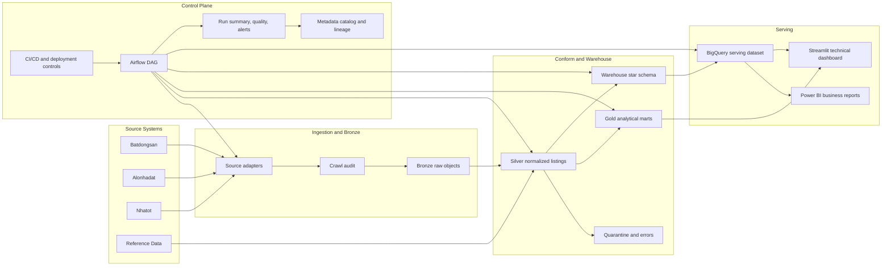

# 01 - Target Architecture and Stage Gates

## Target Architecture



## Architectural Decisions

### Batch First

Daily or scheduled batch remains the default operating model. Snapshot and listing lifecycle analytics fit the domain and preserve raw evidence.

### Bronze Is Immutable History

Bronze stores raw fetch artifacts and crawl metadata per source, crawl date, and crawl id. Reprocessing must start from Bronze whenever parser logic changes.

### Silver Is the Conformed Listing Layer

Silver must normalize source-specific fields into one listing contract before Gold, warehouse, BI, or ML consume them.

### Gold Marts and Warehouse Coexist

Current Gold marts remain useful for operational analytics and Streamlit. V2 adds warehouse facts and dimensions for governed BI modeling.

### BigQuery Is the Production BI Serving Target

Local CSV export may be used during development, but Power BI production should read governed serving tables or views, not unstable local sample files.

## Stage Model

V2 uses stage gates instead of timeline promises. A stage is complete only when its acceptance gate is true.

## Stage 1 - Production Foundation

Goal:

```text
Make the current single-source pipeline trustworthy to run and inspect.
```

Primary work:

```text
remove invalid run summary artifacts from production selection
make environment and dependency assumptions explicit
add run status and data promotion rules
add table and job metadata foundation
add stronger validation and quality gates
```

Gate:

```text
Batdongsan daily batch can run, validate, publish, and produce reliable evidence without manual correction.
```

## Stage 2 - DWH Star Schema

Goal:

```text
Expose stable facts and conformed dimensions for analytics consumers.
```

Primary work:

```text
fact grain and bus matrix
dim_date
dim_location
dim_property_type
dim_source
fact_listing_snapshot
optional fact_price_change and fact_data_quality_daily
warehouse validation and serving views
```

Gate:

```text
Power BI can model daily listing snapshots through documented fact and dimension relationships.
```

## Stage 3 - Multi-Source Production Pipeline

Goal:

```text
Promote source onboarding from experiments to controlled production ingestion.
```

Primary work:

```text
source adapter interface
source-specific Bronze capture
source-specific parser and mapping rules
Silver conformance
cross-source dedup policy
source quality scorecards
```

Gate:

```text
At least two sources flow through Bronze, Silver, warehouse, validation, and BI with source lineage preserved.
```

## Stage 4 - Orchestration, CI/CD, and Cloud Operation

Goal:

```text
Control production execution and recovery.
```

Primary work:

```text
Airflow DAG
task retries and retry visibility
backfill and idempotency policy
CI unit and contract tests
publish controls
IAM and secrets
cloud deployment path
```

Gate:

```text
Runs are task-visible, rerunnable, recoverable, and automatically validated before publication.
```

## Stage 5 - BI Presentation

Goal:

```text
Serve business analytics without mixing BI and engineering diagnostics.
```

Primary work:

```text
BigQuery serving tables or views
Power BI semantic model
business report pages and filters
Streamlit technical dashboard role split
report refresh and data freshness rules
```

Gate:

```text
Business users can inspect market, quality, and lifecycle trends from governed serving data.
```

## Stage 6 - Production Acceptance

Goal:

```text
Prove the system can be operated and handed over.
```

Primary work:

```text
runbook
incident categories
recovery checklist
retention and cleanup policy
final risk review
acceptance evidence pack
```

Gate:

```text
A new operator can run, monitor, backfill, and validate the pipeline using documented procedures.
```

## Promotion Rules

| Output | Development rule | Production rule |
|---|---|---|
| Bronze | May contain failed crawl evidence | Must keep run lineage and raw retention |
| Silver | May include quality flags and failed parse records | Must not silently drop errors without quarantine or summary |
| Gold marts | May be rebuilt from validated Silver | Must only publish from validated Silver inputs |
| Warehouse | Must use documented grain and keys | Must pass fact/dimension validation |
| BigQuery | Development datasets may be disposable | Serving dataset needs stable schema and refresh evidence |
| Power BI | PBIX draft may use CSV | Published report must use governed serving source |

## Cross-Stage Dependencies

```text
Stage 1 quality and metadata rules
  -> required by DWH acceptance

Stage 2 warehouse facts and dimensions
  -> required by Power BI production model

Stage 3 source conformance
  -> required before multi-source BI comparisons

Stage 4 orchestration
  -> required before production runbook sign-off
```

