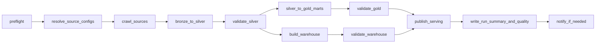

# 05 - Stage 4 Orchestration, CI/CD, and Cloud

## Objective

Stage 4 replaces opaque script-only execution with task-visible, recoverable, validated production operation.

Scripts may remain as task entrypoints. Orchestration controls when and how they run.

## Target Orchestration Path

Recommended v2 path:

```text
Local Airflow DAG for development and validation
  -> production Airflow deployment
  -> optional Cloud Composer if managed orchestration is selected
```

## DAG Design

### Daily DAG



### Task Groups

| Task group | Responsibility |
|---|---|
| Preflight | Runtime, config, destination, and dependency checks |
| Ingestion | Source crawl per source and target config |
| Conformance | Bronze-to-Silver parsing and quarantine |
| Analytics | Current Gold marts |
| Warehouse | Facts, dimensions, and serving views |
| Validation | Contract, row count, quality threshold, and FK checks |
| Publish | GCS/BigQuery publication and refresh markers |
| Observability | Run manifest, summary, metrics, alerts |

## Idempotency and Backfill

### Required Rules

1. Bronze is append-friendly and partitioned by `source`, `crawl_date`, and `crawl_id`.
2. Silver output for a given crawl partition may be recomputed from Bronze.
3. Gold marts and warehouse outputs are rebuilt from validated partitions using deterministic logic.
4. A backfill must identify run scope explicitly:

```text
source set
date or date range
input crawl ids
parser version
warehouse model version
publish target
```

### Backfill Modes

| Mode | Use |
|---|---|
| `reparse` | Bronze exists, Silver parser changes |
| `rebuild_gold` | Silver is valid, analytical marts change |
| `rebuild_warehouse` | DWH logic or dimensions change |
| `republish` | Serving destination needs repair without recomputing raw layers |

## Retry Policy

| Task class | Retry policy |
|---|---|
| Network crawl | Bounded retries with rate limits and blocked-page rules |
| Local transform | Retry only when output cleanup/idempotency is controlled |
| Validation | Do not retry blindly on deterministic contract failures |
| Publish | Retry transient cloud failures, preserve publish manifest |
| Alert | Retry delivery separately from data tasks |

## CI/CD

### CI Minimum

```text
unit tests
contract tests
lint or formatting checks where adopted
docs link and markdown checks where practical
smoke validation on representative fixture data
```

### CI Suggested Pipelines

| Pipeline | Trigger | Purpose |
|---|---|---|
| Pull request | Code change | Unit and contract verification |
| Main branch | Merge | Build artifacts and publish deployable package |
| Manual release | Operator action | Deploy DAG, config, and dashboard changes |

### Deployable Artifacts

```text
Airflow DAG package
Python package or pinned project environment
container image if containerized tasks are adopted
configuration templates
metadata and schema docs
```

## Cloud Target

### Storage

Use GCS for raw and derived batch files:

```text
bronze/
silver/
gold/
warehouse/
logs/
reports/
metadata/
```

### Serving

Use BigQuery for Power BI serving tables or views:

```text
warehouse tables
serving views
quality summary views
refresh markers
```

### Compute

Accepted v2 compute options:

| Workload | Minimum | Production-oriented option |
|---|---|---|
| Crawl and Python transform | VM or container | Managed container or scheduled worker |
| Spark transform | VM Spark runtime | Dataproc or serverless Spark path |
| Orchestration | Local Airflow | Airflow service or Composer |
| Dashboard | Local Streamlit | Controlled deployment for engineering users |

## IAM and Secrets

### Required Controls

```text
service account for pipeline runtime
least-privilege storage and BigQuery permissions
no committed secret keys
secret storage for tokens, webhook URLs, and credentials
separate dev and production config
```

### Publish Permission Principle

Transform tasks may write development outputs. Publication to production serving datasets should use a controlled identity and record a publish manifest.

## Config Strategy

```text
configs/sources/
configs/environments/dev/
configs/environments/prod/
```

Config must separate:

```text
source targets
runtime environment
storage destinations
quality thresholds
publish policy
alert destinations
```

## Stage 4 Acceptance

```text
[ ] DAG shows task dependencies and final state.
[ ] Task retries are bounded and visible.
[ ] Backfill modes are documented and testable.
[ ] CI blocks contract-breaking changes.
[ ] Production config is not mixed with local ad hoc config.
[ ] Publish manifest records outputs and destination.
[ ] Secrets are not stored in repo.
[ ] Cloud permissions are documented.
```

## Stage 4 Exit Gate

Stage 4 is complete when this statement is true:

```text
Production runs are orchestrated, recoverable, automatically validated, and published through controlled cloud and CI/CD paths.
```

